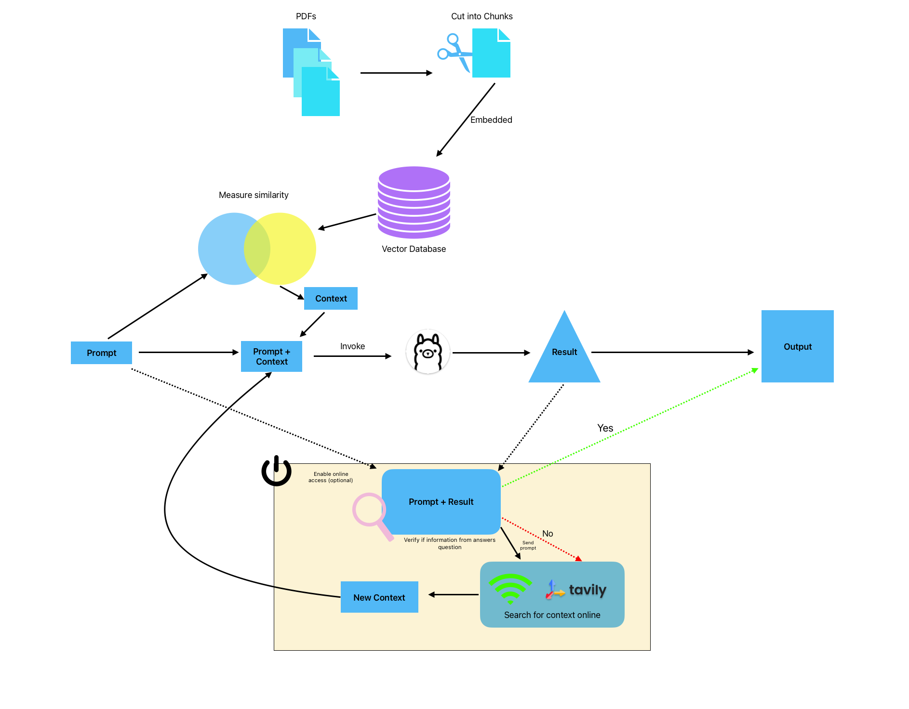

 # RAG with Web Search Capabilities 

## Overview

This repository contains a demo of what a local implementation of a Retrieval-Augmented Generation (RAG) system integrated with Ollama for generating responses would look like. \
The system is designed to operate locally, utilizing the capabilities of an embedded database and Ollama model for generating answers based on available documents or searching the web, using [TAVILY](https://tavily.com/), if necessary. Answers generated using the stored documents will have a sources section, highlighting the document and page number of the sources used as context. \
\
This README will guide you through the setup, functionality, and usage instructions for this repository.

## Features

1. **Local RAG System**: All processing is handled locally without relying on external APIs or databases.
2. **Ollama Integration**: Utilizes Ollama model for generating responses based on retrieved documents.
3. **Web Search Capability**: Automatically searches the web if local resources are insufficient to answer a query.
4. **Validity Check**: Implements checks to ensure that generated answers are grounded in provided facts.
5. **User-Friendly Interface**: Utilizes Streamlit for a simple, interactive user interface.
6. **CLI functionality**: there is a basic CLI functionality that allows users to run the app without Streamlit.

## Getting Started


### Installation

1. Clone the repository to your local machine:
   ```bash
   git clone https://github.com/Triples92/RAG_with_Online_Capabilities.git
   cd repository_name
   ```
2. Install the required Python packages:
   ```bash
   pip install -r requirements.txt
   ```
3. Set up Ollama and ChromaDB according to their respective documentation or provided configurations in this repository.

### Configuration

1. Copy the sample env below to your own newly created `.env` file and fill in the necessary environment variables
   ```plaintext
   BASE_URL=[localhost:11434]
   tavily_API=[your_tavily_api_key]
   ```
2. Configure Streamlit settings if needed by editing `streamlit_config.toml`.

## Usage

### Adding Documents

Currently this system is set up to only accept pdfs. To store the files, create a "Documents" folder inside the app folder and add the documents inside. 
run the database_initialization.py file everytime you add documents to add them into the vector database:
```bash
python database_initialization.py
```
if you want to delete the database, simply delete the 'chroma' folder.
### Running the Application

1. Start the Streamlit app:
   ```bash
   streamlit run GUI.py
   ```
2. Access the application through your browser at the provided URL (usually `http://localhost:8501`).

### Interacting with the Chatbot

- Use the chat input to ask questions based on the document.
- Toggle on "enable online lookup" if you want the system to search for answers beyond local documents.
- The system will display both user prompts and Ollama responses in the interface.

## Examples of Usage

1. **Basic Query**: Ask a question about documents available locally, and the system will respond based on these documents.
2. **External Search**: If the answer is not found in local documents, enable online lookup to search the web for additional information.

## Troubleshooting

- Ensure that all configurations are correctly set up in your .env file and `streamlit_config.toml`.
- Verify that the local database (ChromaDB) contains relevant documents for your queries.
- If encountering issues with external search, ensure network access is allowed and any necessary API keys are correctly configured.

## License

This project is licensed under the BSD 2-Clause License - see the [LICENSE](LICENSE) file for details.

---